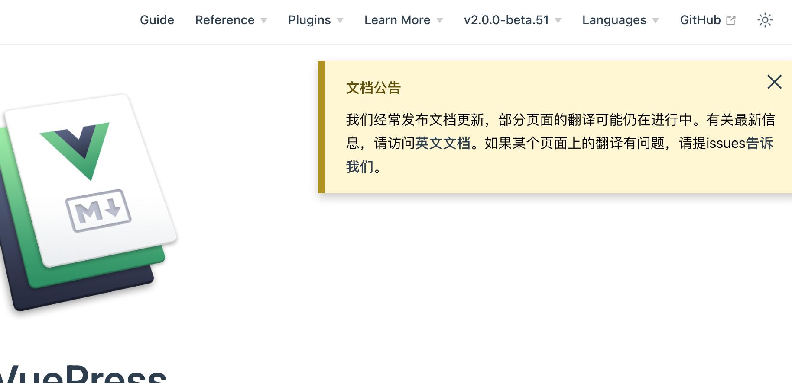

# vuepress-plugin-alert

网站添加通知公告

关闭公告后，不再显示。

## 预览



## 安装

```
npm i vuepress-plugin-alert -S
```

## 配置

```ts
import { alertPlugin } from "vuepress-plugin-alert";

export default defineUserConfig({
  alert: [
    {
      id: "2019-7-29",
      title: "文档公告",
      content: `我们经常发布文档更新，部分页面的翻译可能仍在进行中。有关最新信息，请访问<a href="/en/">英文文档</a>。如果某个页面上的翻译有问题，请提issues<a href="https://github.com/teadocs/matplotlib-cn/issues" target="_blank">告诉我们</a>。`,
    },
  ],
  plugins: [alertPlugin()],
});
```
